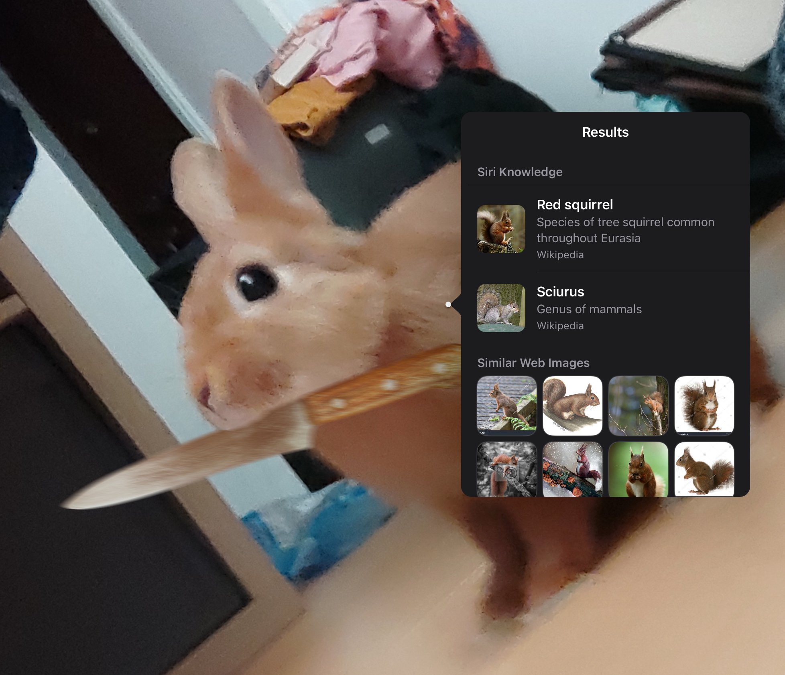

# Pet PNG for Twitch
FalafelAI is based off of this rat bastard here holding a knife.


He's here to make memes and chew gum. Still a wip project. Eventually we do want to incorporate OpenAI GPT-3 to give him a personality, but first we want to give him interactions with twitch alerts and channel point redeems.

## Set up your environment

1. Fork this repo to your own GitHub account
2. Clone this repo to your local machine using GitHub Desktop or Git CML

### **Windows**

**Giving script running privileges**

1. Open Powershell with administrator privileges
2. Run command: `Set-ExecutionPolicy RemoteSigned`
3. Enter `y` to accept Policy Change


**Installing Dependencies**

This is for providing virtual dependencies for the project. You need to manually install a .venv folder.
1. Go to the base project directory `cd FalafelAI`
2. Create a `.venv` in the project folder directory (Using windows explorer or `New-Item .venv`)
3. Run `py -3 -m venv .venv` (Make sure you have **Python 3.11** installed)
4. Activate virtual python environment: `.venv\Scripts\activate`
5. Install dependencies: `pip install -r requirements.txt`

**Create Environment Variables**
1. Create a new file `.env` in the base directory. 
2. Open file and add these two lines
```
export DATABASE=schema.sql
export APP_TOKEN= <Ask Pat for this one>
```
- Do not push your personal .env to GitHub as it can potentially hold sensitive data. Eventually production will have its own .env file.

**To run project**
1. Execute `python .\flaskr\app.py`
2. Go to http://localhost:5000
3. Yipee
4. When making changes, you need to refresh the page to reload the cache and allow the changes to take effect.

**When running this app on production, make sure to make debug false in `app.run`**
(Although it's probs not gonna be a while til we make this in production)
```
if __name__ == "__main__":
    app.run(debug=False, host='0.0.0.0')
```

Layout may be subject to change as there could be more files

## Git practices
When creating a new feature or fixing a bug, create a new branch:
```
git checkout -b feature/<whateverBranchName>
```
(`checkout` changes your branch to whatever branch you are changing to, `-b` means you are creating a new branch followed by the branch name)

That will create a fresh environment outside of main to develop your changes in.

**A general idea to follow is commit often, push once.**

Of course, there isn't a hard rule on when to commit, but do it often so when there are git issues, it's much easier to resolve them without affecting your other work.


## Main features (for now)
When I say PNG, I mean PNG/GIF and any other image format that the user can use for this software.
- Web app is ran locally initially. User will need to run the software to interact with the streaming software.
- A PNG that works similar to a PNGtuber, but also uses TTS to interact with the audience.
- Requires two PNGs, one for speaking and one for idling
- User will be able to choose the TTS voice they want for their pet
- Uses twitch API to react to channel point redeems, alerts (followers, subs, cheer, etc.).
    - PNG can only have a single response per event
- User will be able to choose which events the PNG can respond to
- A database will be installed to save the responses so the software can reference it later
- Can be outputted as a browser source to use in streaming software (OBS, SLOBS, Twitch Studio).

## Future Features
- Incorporate OpenAI GPT-3 (or 4) so that the PNG can have custom responses or respond to questions.
- Give the software access to the internet so users do not have to run it locally.
- Allow monitization to fund for OpenAI and hardware usage.
- Username + password to allow unique accounts for each user.
- It would be cool to be able to use this on other software like vtube studio, but this seems like a far-fetched idea.

Shoutout to Licore_Art, LucidLuminary, and LittleKityKat for helping me with this project :D

